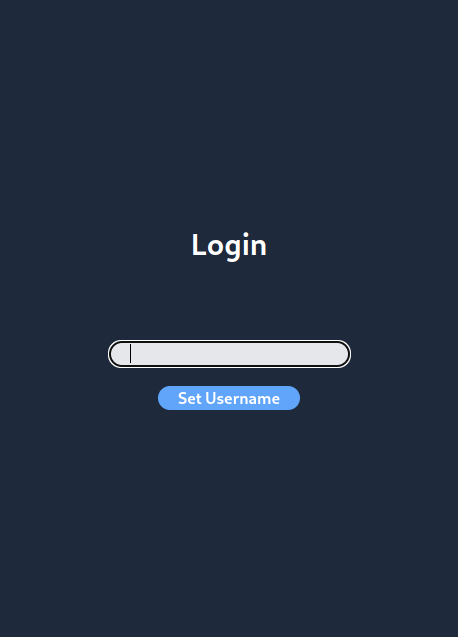
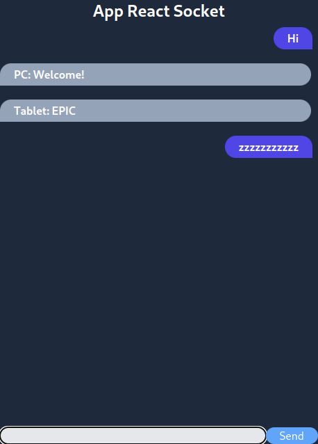

# Chat React Socket

A real-time chat application built with React and Node.js.


<p align="center">
    
</p>

<p align="center">
    
</p>


## Installation

Clone this repository to your local machine:

```bash
git clone https://github.com/bestiannn/chat-react-socket
```

Install dependencies in the root project folder and in the client folder:

```bash
npm install
```

## Running

To start the server and client app in development mode, run:

```bash
npm run dev
npm run dev:client
```

WARNING: Some lines in the code are disabled for the dev mode, of you want to edit the code, make sure to uncomment these lines

To build the client app for production and run the server, run:

```bash
npm run start
```
